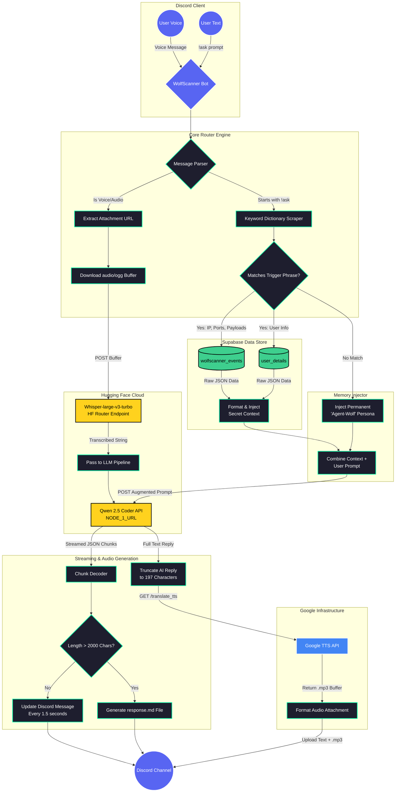

```mermaid
flowchart TD
    %% Define System Colors & Styles
    classDef discord fill:#5865F2,stroke:#fff,stroke-width:2px,color:#fff;
    classDef hub fill:#1E1E2E,stroke:#00FFAA,stroke-width:2px,color:#fff;
    classDef ai fill:#FFD21E,stroke:#000,stroke-width:2px,color:#000;
    classDef db fill:#3ECF8E,stroke:#000,stroke-width:2px,color:#000;
    classDef external fill:#4285F4,stroke:#fff,stroke-width:2px,color:#fff;

    %% --- 1. FRONTEND / TRIGGER LAYER ---
    subgraph Discord Client
        U1((User Voice)) -- "Voice Message" --> D1{WolfScanner Bot}
        U2((User Text)) -- "!ask prompt" --> D1
    end

    %% --- 2. NEXUS-AI HUB (NODE.JS / EXPRESS) ---
    subgraph Nexus-AI Hub [Core Router Engine]
        D1 --> Router{Message Parser}

        %% Audio Pipeline Path
        Router -- "Is Voice/Audio" --> A1[Extract Attachment URL]
        A1 --> A2[Download audio/ogg Buffer]
        
        %% Text Pipeline Path
        Router -- "Starts with !ask" --> T1[Keyword Dictionary Scraper]
        T1 --> T2{Matches Trigger Phrase?}
    end

    %% --- 3. THE DATABASE / SIEM LAYER ---
    subgraph Supabase Data Store
        T2 -- "Yes: IP, Ports, Payloads" --> DB1[(wolfscanner_events)]
        T2 -- "Yes: User Info" --> DB2[(user_details)]
        DB1 -- "Raw JSON Data" --> T3["Format & Inject <br>Secret Context"]
        DB2 -- "Raw JSON Data" --> T3
    end

    %% --- 4. CONTEXT ASSEMBLY ---
    subgraph Memory Injector
        T2 -- "No Match" --> T4["Inject Permanent <br>'Agent-Wolf' Persona"]
        T3 --> T5["Combine Context + <br>User Prompt"]
        T4 --> T5
    end

    %% --- 5. THE AI / BRAIN LAYER ---
    subgraph Hugging Face Cloud
        A2 -- "POST Buffer" --> HF1["Whisper-large-v3-turbo <br>HF Router Endpoint"]
        HF1 -- "Transcribed String" --> A3[Pass to LLM Pipeline]
        
        A3 --> QW1
        T5 -- "POST Augmented Prompt" --> QW1["Qwen 2.5 Coder API <br>NODE_1_URL"]
    end

    %% --- 6. OUTPUT PROCESSING ---
    subgraph Streaming & Audio Generation
        %% Text Output Handling
        QW1 -- "Streamed JSON Chunks" --> T6[Chunk Decoder]
        T6 --> T7{Length > 2000 Chars?}
        T7 -- "No" --> T8["Update Discord Message <br>Every 1.5 seconds"]
        T7 -- "Yes" --> T9["Generate response.md File"]

        %% Audio Output Handling
        QW1 -- "Full Text Reply" --> A4["Truncate AI Reply <br>to 197 Characters"]
    end

    %% --- 7. EXTERNAL TTS BYPASS ---
    subgraph Google Infrastructure
        A4 -- "GET /translate_tts" --> G1[Google TTS API]
        G1 -- "Return .mp3 Buffer" --> A5[Format Audio Attachment]
    end

    %% --- 8. DELIVERY ---
    T8 --> D2((Discord Channel))
    T9 --> D2
    A5 -- "Upload Text + .mp3" --> D2

    %% Apply Classes for visual styling
    class U1,U2,D1,D2 discord;
    class Router,A1,A2,A3,A4,A5,T1,T2,T3,T4,T5,T6,T7,T8,T9 hub;
    class HF1,QW1 ai;
    class DB1,DB2 db;
    class G1 external;
```
